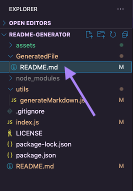
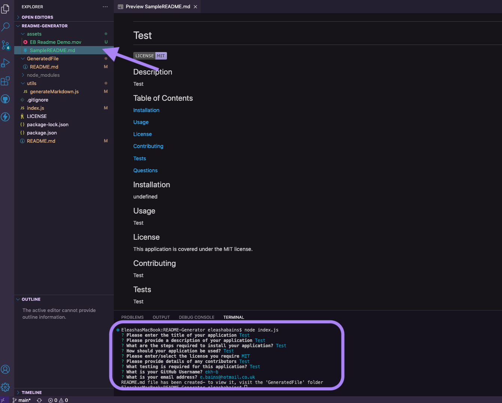

# README-Generator

## Description

This is a command-line application that dynamically generates a professional README.md file from a users input.

## Video demonstration 

Click on the link below to see a demonstration of the application:

https://drive.google.com/file/d/1e8ZRCAbWsw7bRr9sMahUmeUfc2hZ0AFs/view?usp=share_link

## Installation

Following installations are required in order to use this application:

- Install node (https://nodejs.org/en/download) -If homebrew is already installed run command ***brew install node@16***)
- Install filing system node module
- Install inquirer: ***init-y*** followed by ***npm install --save inquirer@^8.0.0***

## Usage

- To run this application enter the following command in terminal ***node index.js*** and answer the questions when prompted.

- Once the application has run, the README file can be found in the 'Generated Files' folder:

- The Sample README file from the demonstation can be viewd in the assets folder:

## Credits/Resources used

- https://www.freecodecamp.org/news/how-to-write-a-good-readme-file/
- https://shields.io
- https://dev.to/cicirello/badges-tldr-for-your-repositorys-readme-3oo3
- https://www.markdownguide.org/basic-syntax/#images-1
- https://gist.github.com/qvil/5e3ed56c26d784e51424621119cc4028
- https://coding-boot-camp.github.io/full-stack/github/professional-readme-guide

## License

[MIT](https://choosealicense.com/licenses/mit/)

